# Getting Started

SLRT (Systematic Literature Review Tool) guides you through every stage of a systematic
review, from importing references to generating a PRISMA diagram, in a single
collaborative workspace.

## The Application Shell

Every page shares the same outer shell so the most important controls are always within
reach.

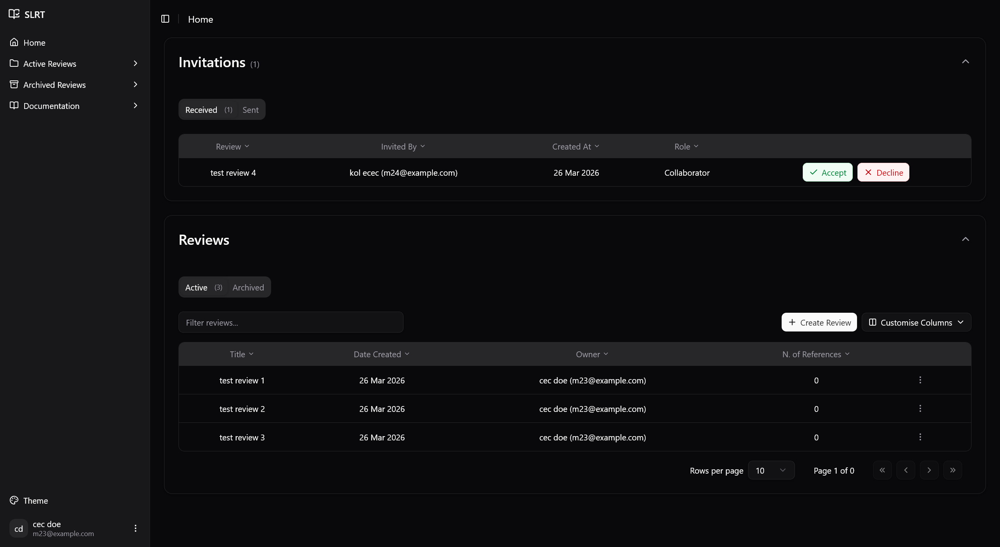

**Sidebar:** The collapsible panel on the left lists your active and archived reviews.
Clicking the arrow next to a review expands it inline so you can jump straight to any
stage without visiting the home page first. A **Documentation** entry at the bottom of
the navigation links to this guide. The sidebar footer contains the **Theme** toggle
(light / dark) and your **user avatar menu**, which gives access to profile editing and
password management.

**Review tab bar:** Once a review is open, a horizontal tab bar runs across the top of
the content area with tabs for **Overview**, **Review Data**, **Screening**, **Full Text
Screening**, **Data Extraction**, **Coding & Theming**, **Charts**, and **PRISMA**. Any
stage is reachable within two clicks from anywhere in the application.

**Chat & Settings:** A chat bubble icon and a **Settings** menu are pinned to the right
end of the tab bar. The chat button opens a slide-in drawer; a blue badge shows the
number of unread messages when the drawer is closed.

## Your First Review

<Steps>

<Step>Log in and go to the home page.</Step>

<Step>
  Click **+ Create Review** in the Reviews table toolbar. Enter a title and an
  optional description, then confirm.
</Step>

<Step>
  Your new review appears in the **Active** tab of the Reviews table. Click its
  title to open it and land on the **Overview** page.
</Step>

<Step>
  From the Overview, click **Add References** to import a BibTeX, RIS, or
  EndNote XML file. See the [Review Overview](/docs/user-guide/review-overview)
  guide for details.
</Step>

<Step>
  Once references are imported, work through the stages in order: **Screening →
  Full Text Screening → Data Extraction → Coding & Theming**. The tab bar keeps
  each stage one click away.
</Step>

<Step>
  When the review is complete, visit **PRISMA** to generate and download the
  flow diagram.
</Step>

</Steps>

## Managing Invitations

The **Invitations** panel at the top of the home page shows any pending invitations you
have received. Each row displays the review name, who sent the invitation, when it was
created, and the role you have been offered. Click **Accept** to join the review or
**Decline** to dismiss the invitation.

You can also switch to the **Sent** tab to see invitations you have dispatched to other
collaborators and their current status.

## Roles

Every member of a review holds one of four roles that control what they can do:

| Role             | What they can do                                                             |
| ---------------- | ---------------------------------------------------------------------------- |
| **Owner**        | Full access: edit the review, invite members, manage duplicates, import data |
| **Collaborator** | Everything except inviting members and changing review settings              |
| **Reviewer**     | Submit opinions, add notes, apply labels, edit keywords                      |
| **Viewer**       | Read-only access to all review data                                          |

## Light and Dark Mode

Click **Theme** in the sidebar footer to switch between light and dark mode. The
application also respects your operating system preference on first load.

# Review Overview

The Overview is the control panel for a review. It is the first page you see after
opening a review and the place you return to for data management, duplicate handling,
member administration, and progress monitoring.

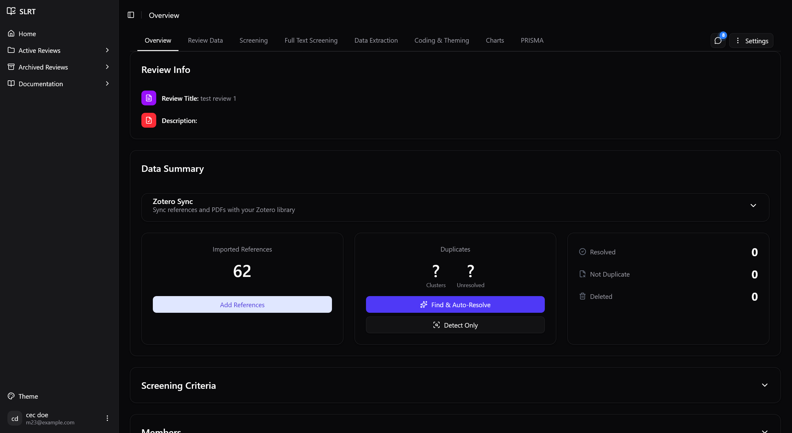

The page is organised into collapsible cards. **Review Info** and **Data Summary** are
expanded by default; **Screening Criteria**, **Members**, and **Statistics** start
collapsed to keep the page uncluttered.

---

## Review Info

Shows the review title and description. The review owner can edit these from the
**Settings** menu in the tab bar.

---

## Data Summary

The Data Summary card is where you bring data into the review. It contains three
sections side by side.

### Importing References

Click **Add References** to open the Upload References dialog. You can drag and drop or
browse to select one or more files in **BibTeX** (`.bib`), **RIS** (`.ris`), or
**EndNote XML** (`.xml`) format. Multiple files can be queued simultaneously and each
is given its own named Search Method entry.

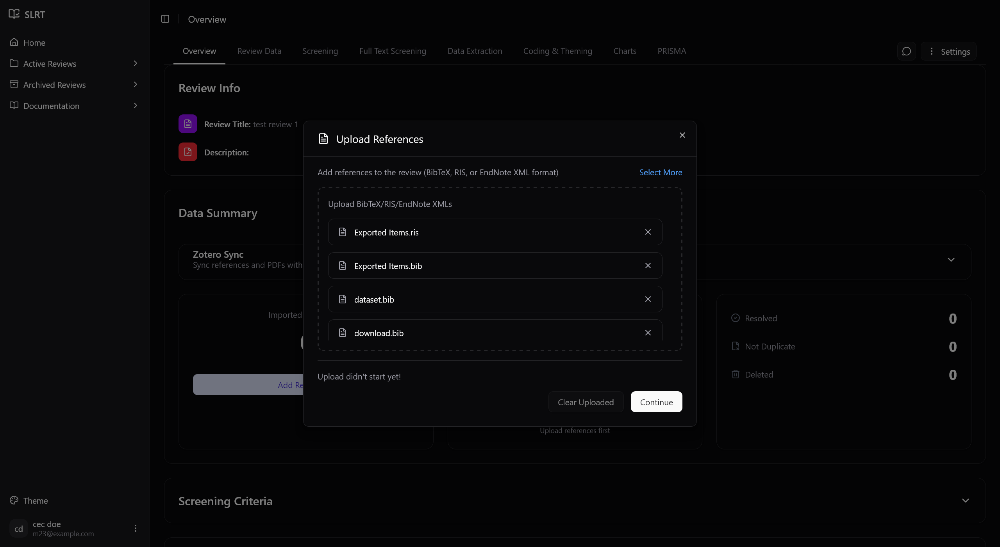

Click **Continue** to start the import. The files are processed in the background. A
system message appears in the review chat when the import finishes, showing how many
references were imported. You do not need to stay on the page while the import runs.

### Zotero Sync

Expand the **Zotero Sync** section to connect a Zotero personal or group library.
Once configured, you can pull references and their attached PDFs directly from Zotero
without exporting files manually. Push operations send included references back to your
Zotero collection. The sync runs in the background and reports progress via the chat.

### Duplicate Management

The three-column widget tracks the state of duplicate detection across the review.

- **Imported References**: the total count of all non-deleted references, with the **Add References** button.
- **Duplicates**: the number of detected clusters and how many remain unresolved, with **Find & Auto-Resolve** and **Detect Only** buttons.
- **Resolution breakdown**: counts of Resolved, Not Duplicate, and Deleted references.

#### Auto-Resolver

Click **Find & Auto-Resolve** to open the Auto-Resolver dialog. This runs detection
and immediately resolves high-confidence clusters without manual review.

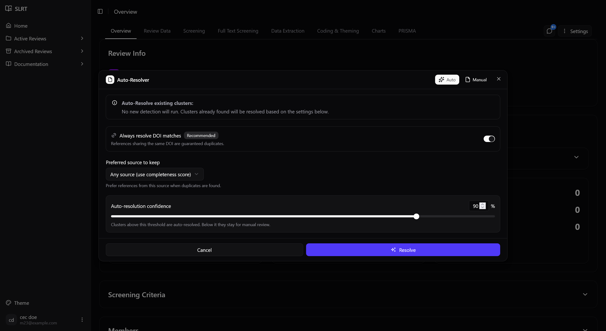

- **Always resolve DOI matches**: references sharing the same DOI are guaranteed
  duplicates. This toggle is recommended and on by default.
- **Preferred source to keep**: if you prefer references from a particular database,
  select that Search Method here. Otherwise, the most complete record is kept automatically.
- **Auto-resolution confidence**: clusters whose similarity score is above this
  threshold (default 90%) are resolved automatically. Clusters below the threshold are
  held for manual review.

Click **Detect Only** if you want to detect clusters without resolving any of them yet,
then review them manually at your own pace.

#### Manual Duplicate Resolution

Click **Resolve Duplicates** (or switch to the **Manual** tab in the Auto-Resolver
dialog) to review unresolved clusters one by one.

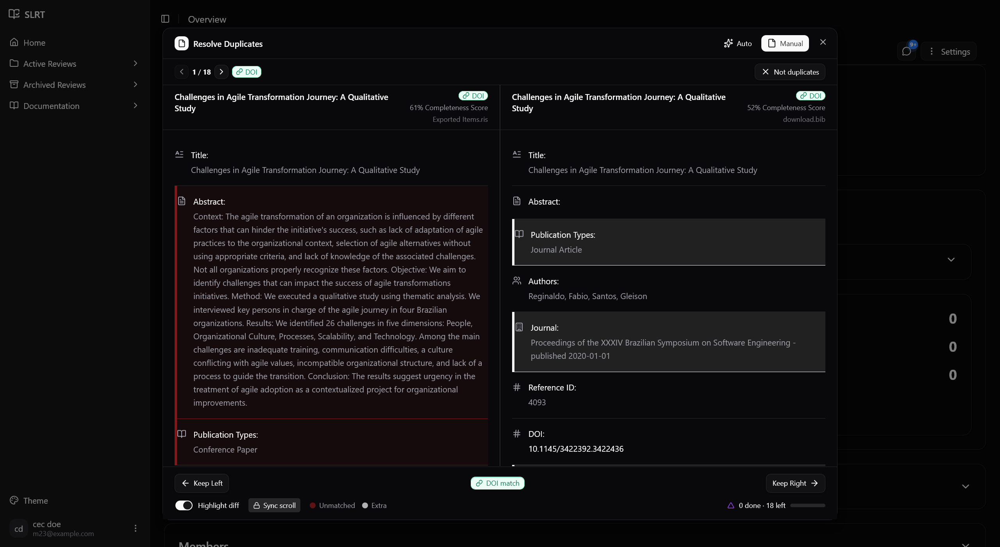

Each cluster shows two candidate records side by side. Fields that differ between the
two records are highlighted. Use the navigation arrows to move between clusters. The
footer shows your progress (e.g. 1 / 18).

- **Keep Left**: keep the left record and delete the right.
- **Keep Right**: keep the right record and delete the left.
- **Not duplicates**: dismiss the cluster; both records remain active.
- **Highlight diff** toggle: turn field-level highlighting on or off.
- **Sync scroll** toggle: scroll both panels together.

---

## Screening Criteria

The Screening Criteria card lists the inclusion and exclusion criteria that guide all
reviewers during screening. Owners and Collaborators can add, edit, and delete criteria
here. The criteria are also accessible from the Screening page by pressing the `C` key,
which opens a floating popover without leaving the current reference.

---

## Members

The Members card lists all current members of the review with their name, email address,
and role. The **Invite** button in the card header opens an invitation dialog where you
can type one or more email addresses, choose a role for each invitee, and send the
invitation. Invitees receive an email and can accept or decline from the home page.

> Only the review **Owner** can send invitations.

---

## Statistics

The Statistics card provides per-reviewer progress charts across three tabs.

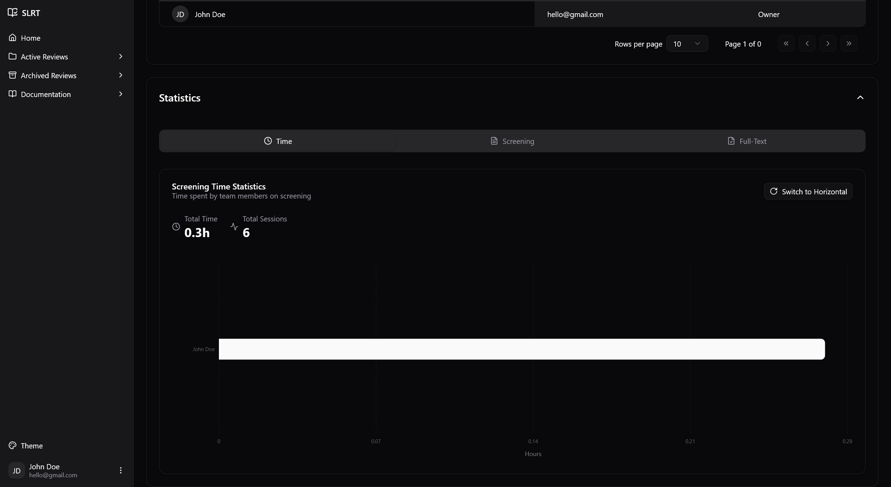

**Time**: a horizontal bar chart showing total hours spent in title/abstract screening
and full-text screening per reviewer. The total time and number of sessions are shown
above the chart.

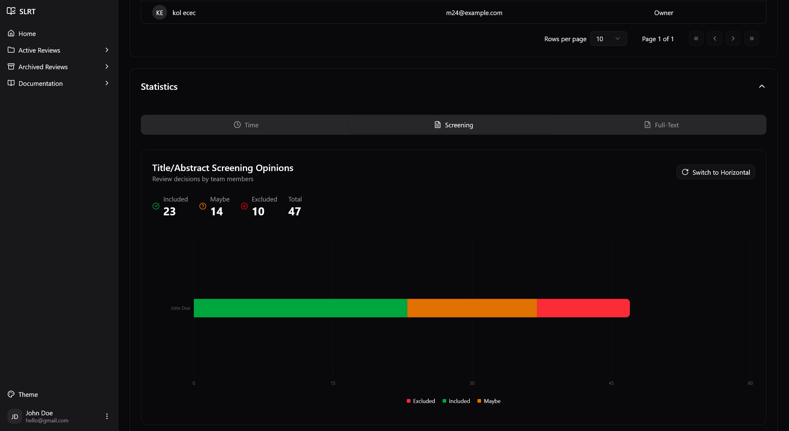

**Screening**: a segmented bar chart where each reviewer's bar is divided into green
(Included), orange (Maybe), and red (Excluded) segments, with the total count of
decisions shown as summary numbers above.

**Full-Text**: the same segmented chart for full-text screening decisions.

> When **blinded mode** is enabled (configured in Settings), each reviewer sees only
> their own statistics. When blinded mode is off, all reviewers' data is visible to
> every member.

# Review Data

The Review Data page gives you a complete, filterable view of every reference in the
review, including imported duplicates, deleted records, and references at every stage
of the workflow. It is the master reference browser and the best place to inspect the
raw imported data.

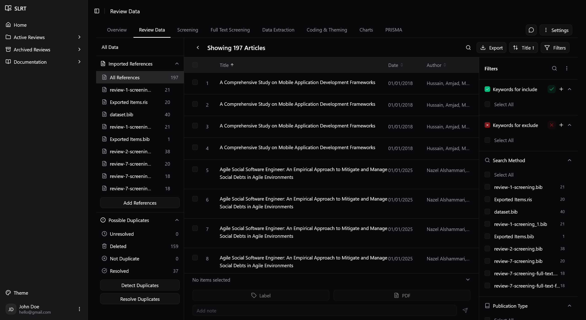

---

## Layout

The page uses a three-column layout.

**Left sidebar, Sources** lists every Search Method (imported file) alongside a reference
count. Clicking a Search Method filters the main table to show only references from that
source. The sidebar also has a **Possible Duplicates** section with sub-entries for
Unresolved, Deleted, Not Duplicate, and Resolved clusters, letting you quickly audit the
outcome of duplicate detection. An **Add References** button at the bottom of the sidebar
allows you to import additional files without returning to the Overview.

**Centre, References table** shows the filtered set of references with columns for
Title, Date, and Author. Click any column header to sort. Click a row to select it and
open the action bar at the bottom of the table. Multiple rows can be selected with
checkboxes for bulk actions.

**Right sidebar, Filters** mirrors the filter panel from the Screening pages (see
[Screening](/docs/user-guide/screening) for full filter details). Filters include
Keywords for include/exclude, Search Method, Publication Type, and more.

---

## Toolbar Actions

| Button          | Action                                                                   |
| --------------- | ------------------------------------------------------------------------ |
| **Search** (🔍) | Full-text search across titles and abstracts                             |
| **Export**      | Download the current filtered set as BibTeX                              |
| **Title ↑**     | Sort toggle, click repeatedly to cycle ascending / descending / unsorted |
| **Filters**     | Show or hide the right-hand filter sidebar                               |

---

## Row Actions

Selecting one or more references reveals an action bar at the bottom of the table:

- **Label**: apply or create a colour-coded label.
- **PDF**: attach a PDF to the selected reference.
- **Add note**: type a note in the note field at the bottom and press Enter or the send icon to save it.

Clicking the paperclip icon (🖇) in the Full Text column on any row opens the PDF
attachment flow for that specific reference directly.

---

## Duplicate Views

Click **Detect Duplicates** or **Resolve Duplicates** in the left sidebar to trigger the
same duplicate management flows described on the [Review Overview](/docs/user-guide/review-overview)
page. The Review Data page provides a convenient shortcut to these tools without
needing to navigate back to the Overview.

# Screening

The Screening page is where you read titles and abstracts and assign an opinion to each
reference: Include, Maybe, or Exclude. It is designed for sustained focus; the three-column
layout keeps the full list navigable, the detail panel visible, and the filters
accessible without switching pages.

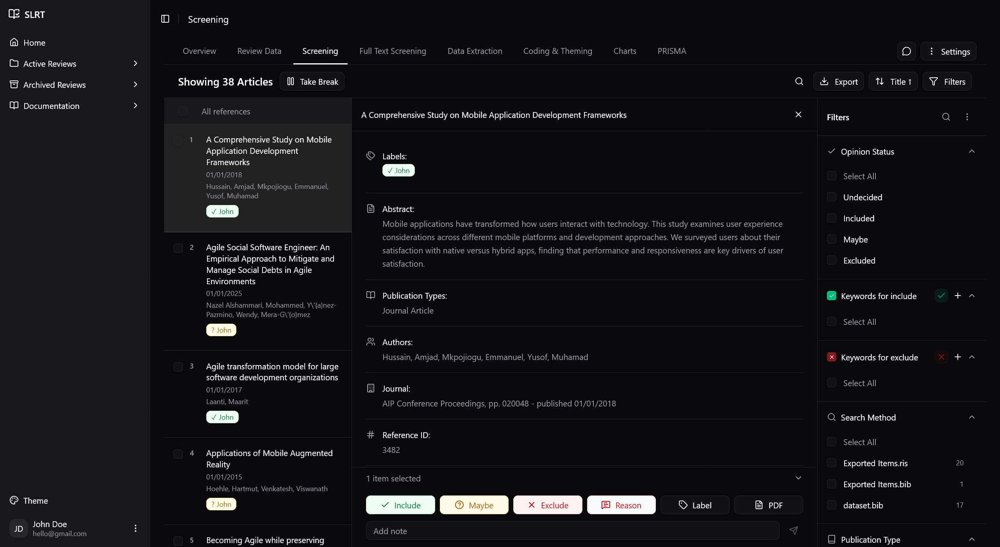

---

## Layout

### Reference List (left)

Shows all references in the current filtered view with a running count at the top
(**Showing N Articles**). Each row displays the title, publication date, and authors.
A coloured badge under a reference indicates any labels applied to it (e.g. a green
"John" badge). Rows support infinite scroll; 50 references are loaded per page as you
scroll down, so the page stays responsive for large imports.

Click a row to select it and open it in the detail panel. Use the checkbox to the left
of a row for bulk selection; a toolbar at the bottom of the page appears when one or
more rows are selected for bulk actions.

### Detail Panel (centre)

Opens automatically when a reference is selected. It shows:

- **Labels** applied by the current reviewer
- **Abstract**
- **Publication Type**, **Authors**, **Journal** (with publication date)
- **Reference ID** (internal)
- **DOI** (clickable link)
- **Search Method** (which imported file this reference came from)
- **Notes:** a note input field at the bottom; press Enter or the send icon to save

The **action footer** is pinned to the bottom of the panel with five buttons:

| Button        | Action                                                       |
| ------------- | ------------------------------------------------------------ |
| **Include** ✓ | Mark the reference as included                               |
| **Maybe** ?   | Mark the reference as uncertain                              |
| **Exclude** ✗ | Mark the reference as excluded                               |
| **Reason**    | Attach an exclusion reason (visible in the PRISMA breakdown) |
| **Label**     | Apply or create a colour-coded personal label                |
| **PDF**       | Attach a PDF file to this reference                          |

Clicking Include, Maybe, or Exclude immediately saves the opinion and auto-advances to
the next reference in the list, keeping the screening flow uninterrupted.

### Filter Sidebar (right)

The filter sidebar provides faceted filtering. All filters are additive and debounced;
changes take effect after a short pause to avoid firing a request on every keystroke.

| Filter                   | Description                                                                         |
| ------------------------ | ----------------------------------------------------------------------------------- |
| **Opinion Status**       | Undecided / Included / Maybe / Excluded                                             |
| **Keywords for include** | Add green-highlighted terms; matching words are highlighted in titles and abstracts |
| **Keywords for exclude** | Add red-highlighted terms; matching words are highlighted in red                    |
| **Search Method**        | Filter by the source file the reference was imported from                           |
| **Label**                | Filter by your personal labels                                                      |
| **Publication Type**     | Journal Article, Conference Paper, etc.                                             |
| **Publication Year**     | Year checkboxes                                                                     |
| **File Status**          | Has PDF / No PDF                                                                    |
| **Assignee**             | Filter to references assigned to a specific reviewer                                |

Click the **search icon** (🔍) at the top of the filter sidebar to search within a filter
section. The three-dot menu next to the search icon lets you reset all active filters.

---

## Toolbar

| Button          | Action                                                                                          |
| --------------- | ----------------------------------------------------------------------------------------------- |
| **Take Break**  | Pauses your active screening time session; the server stops counting your time until you resume |
| **Search** (🔍) | Full-text search across titles and abstracts                                                    |
| **Export**      | Download the current filtered set as BibTeX                                                     |
| **Title ↑**     | Sort toggle                                                                                     |
| **Filters**     | Show or hide the filter sidebar                                                                 |

---

## Keyword Highlighting

When keywords are active in the filter sidebar, matching words are highlighted inline
in the abstract shown in the detail panel. Inclusion keywords are highlighted in
**green**; exclusion keywords are highlighted in **red**. This lets you spot the most
relevant or disqualifying terms at a glance without reading the full abstract.

---

## Screening Criteria Popover

Press the **`C`** key at any time to open a floating popover in the top-left of the
viewport listing all inclusion and exclusion criteria defined for the review. The popover
stays open while you screen and can be dismissed by pressing `C` again or clicking
outside it.

---

## Reference Drawer

Click the expand icon on any reference row to open a full-screen drawer for that
reference. The drawer includes navigation arrows so you can step through the filtered
list without returning to the table, which is useful for deep reading during full-text screening.
On mobile, the drawer replaces the detail panel and expands to fill the full screen.

---

## Blinded Mode

When the review owner has enabled **blinded mode** (Settings > Review Settings), you
can only see your own opinions on each reference, not those of other team members.
When blinded mode is off, a consensus status is shown on each row derived from all
reviewers' opinions: if all reviewers agree the status is shown directly; if opinions
conflict the reference appears as Undecided until the conflict is resolved.

---

## Bulk Actions

Select multiple references using the row checkboxes. A bulk action bar appears at the
bottom of the page with the following actions:

- **Include / Maybe / Exclude / Reason:** apply the same decision to all selected references at once.
- **Label:** apply a label to all selected references.
- **PDF:** open the PDF upload dialog for the selected references.

---

## Time Tracking

SLRT automatically tracks the time you spend on the Screening page and counts it toward
your screening statistics visible on the Overview. The timer runs while the page is
active. If you open the same review in multiple tabs, only one session is counted at a
time. Click **Take Break** to pause tracking; navigate away or close the tab to end the
session. Sessions shorter than five seconds are discarded automatically.

# Full Text Screening

Full Text Screening is the second screening stage. References that were **included** or
marked **Maybe** during title/abstract screening are promoted here for a deeper read of
the full paper. The page uses a flat table layout rather than the three-column detail
panel of the Screening page, because reviewers typically need the full PDF open rather
than just the abstract.

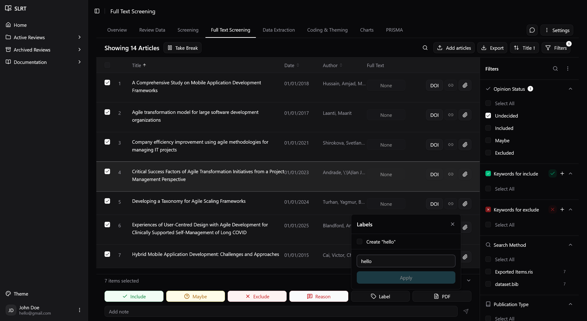

---

## Layout

Each row in the table shows the **Title**, **Date**, **Author**, and a **Full Text**
column. The Full Text column contains up to three action buttons:

| Button          | Meaning                                                                             |
| --------------- | ----------------------------------------------------------------------------------- |
| **DOI**         | Open the reference's DOI link in a new tab                                          |
| **🔗** (URL)    | Open the reference's URL in a new tab                                               |
| **🖇** (Attach) | Attach a PDF to this reference                                                      |
| **View**        | Open the attached PDF in the in-browser PDF viewer (appears once a PDF is attached) |

The filter sidebar on the right works identically to the Screening page, see
[Screening → Filter Sidebar](/docs/user-guide/screening#filter-sidebar) for details.

The action bar at the bottom of the table provides **Include**, **Maybe**, **Exclude**,
**Reason**, **Label**, and **PDF** buttons that apply to all selected rows.

Click **Add articles** in the toolbar to manually promote additional references from the
Screening stage into Full Text without going back to the Screening page.

---

## Attaching PDFs

### Uploading PDFs in bulk

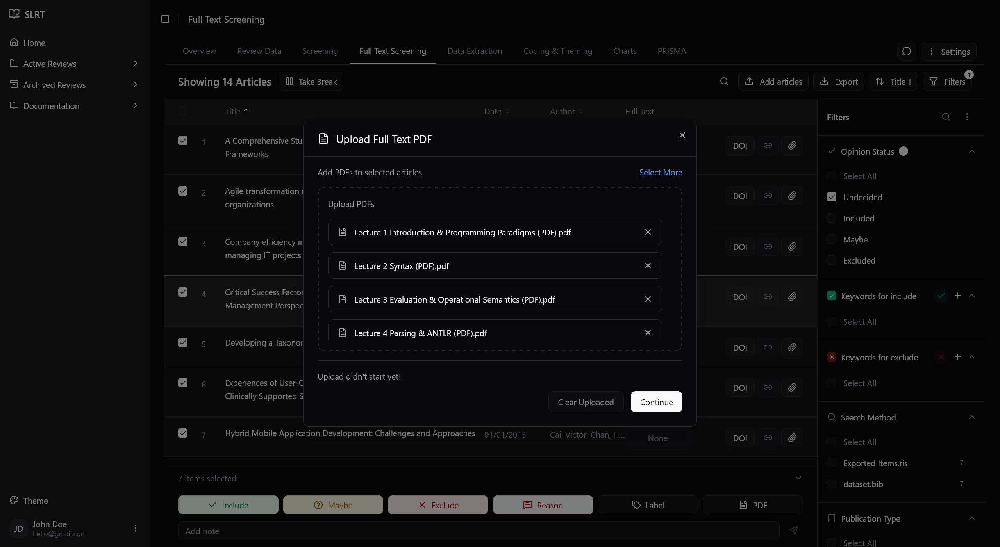

Select one or more references using the row checkboxes, then click **PDF** in the action
bar (or click the 🖇 icon on a single row). The **Upload Full Text PDF** dialog opens.
Drop or browse for PDF files and click **Continue**. Files are uploaded and an
automatic matching step attempts to pair each PDF to a reference.

### Auto-matching

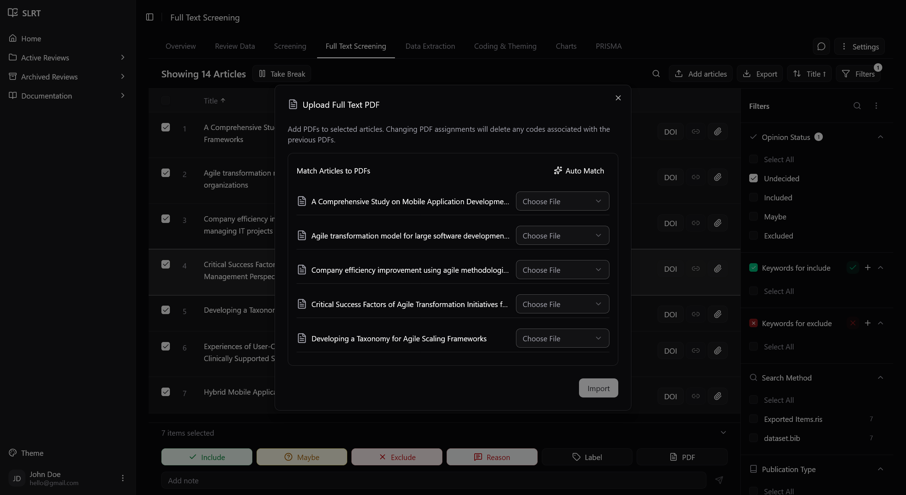

After uploading, the **Match Articles to PDFs** step is shown. Click **Auto Match** to
let the system automatically match PDFs to references using DOI extraction from the PDF
cover page, then by title similarity. Matches are shown next to each reference. You can
also use the **Choose File** dropdown on each row to assign a PDF manually. Click
**Import** to confirm all assignments and save them.

### Managing uploaded PDFs

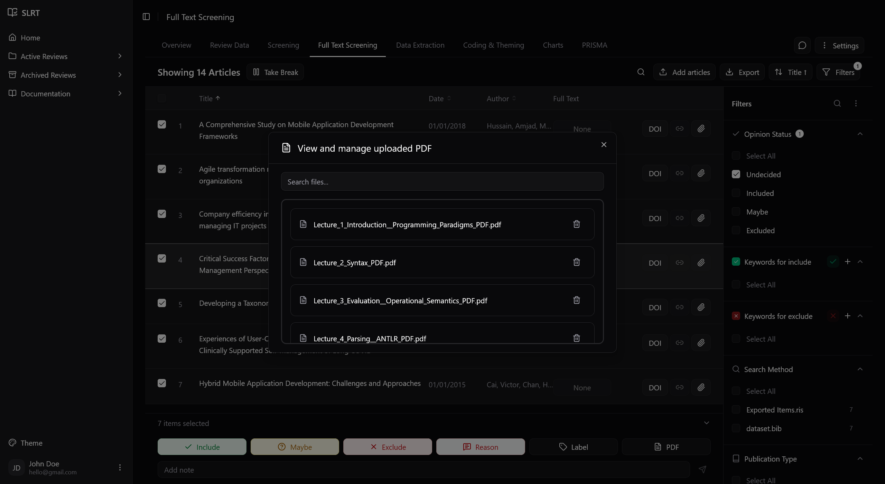

Click the **🖇** icon on a row that already has a PDF to open the **View and manage
uploaded PDF** dialog. This shows a searchable list of all PDFs currently in the review's
upload pool. You can delete individual files from here to free storage. Reassigning a PDF
to a different reference will delete any coding annotations associated with the previous
PDF.

---

## Labels

Click **Label** in the action bar (or on a single reference row) to open the Labels
popover. Type to search existing labels or type a new name and click **Create** to add
it. Labels are personal, they are visible only to you and can be used to organise or
flag references for your own workflow.

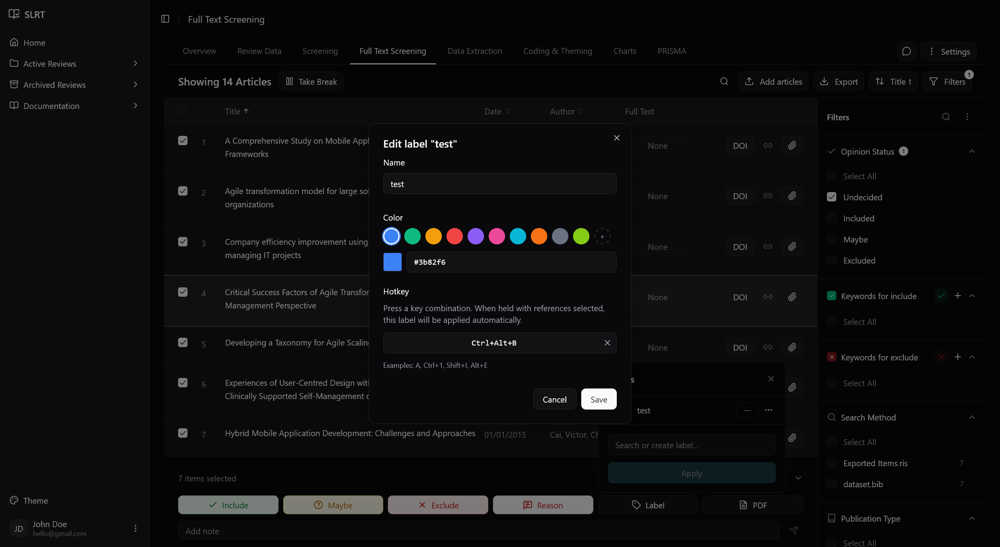

To edit an existing label, change its colour, rename it, or assign a keyboard shortcut,
open the Labels popover, hover over the label, and click the edit icon. The hotkey
field accepts a single character; once set, pressing that key while a reference is
selected applies the label instantly.

---

## Viewing a PDF

Click the **View** button on any row that has an attached PDF. This opens the in-browser
PDF viewer in a full-screen modal. In Full Text Screening the viewer is read-only, you
can read and navigate the document but cannot create highlights. Use the arrow buttons at
the top of the viewer to navigate to the previous or next reference in the current
filtered list.

---

## Time Tracking

Like the Screening page, SLRT tracks the time you spend on the Full Text Screening page.
Click **Take Break** in the toolbar to pause tracking. See
[Screening → Time Tracking](/docs/user-guide/screening#time-tracking) for full details.

# Data Extraction

The Data Extraction page presents all references that have been included through full-text
screening as rows in a spreadsheet-style table. Each column corresponds to a
researcher-defined extraction question. You fill in answers by clicking directly into
cells, building a structured dataset from your included literature.

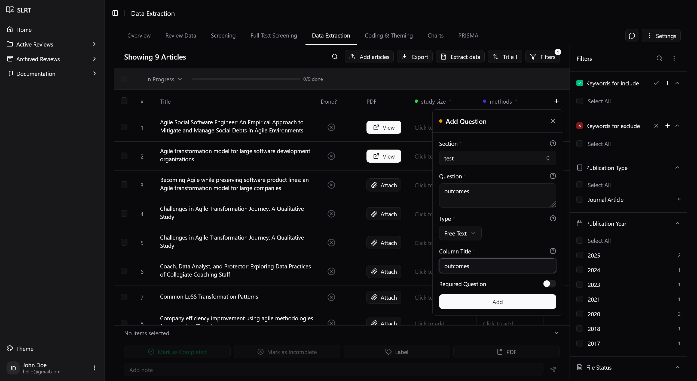

---

## Table Structure

The table always shows **Title**, **Done?**, and **PDF** as fixed columns, followed by
your custom extraction question columns. Questions are grouped into **Sections**, each
section appears as a coloured dot followed by the section name in the column header.

A **progress bar** at the top of the table tracks how many references have been marked
as fully extracted (the **Done?** column). The dropdown next to it lets you filter the
table to show **In Progress**, **Completed**, or **All** references.

---

## Answering Questions

Click any cell in the table to start entering an answer. The input type matches the
question type defined by the review owner:

| Question type     | Input                                  |
| ----------------- | -------------------------------------- |
| **Free Text**     | Multi-line textarea                    |
| **Number**        | Numeric input                          |
| **Date**          | Date picker                            |
| **Boolean**       | Yes / No                               |
| **Single Select** | Dropdown with one option               |
| **Multi Select**  | Dropdown that accepts multiple options |

Answers are saved automatically as you type or select. Click outside the cell to
confirm and close the editor.

---

## Marking as Complete

When you have answered all questions for a reference, click **Mark as Completed** in the
action bar at the bottom of the page (select the row first). The **Done?** column for
that row changes to a green checkmark and the progress bar updates. Click **Mark as
Incomplete** to revert a row.

---

## Viewing the PDF Alongside Extraction

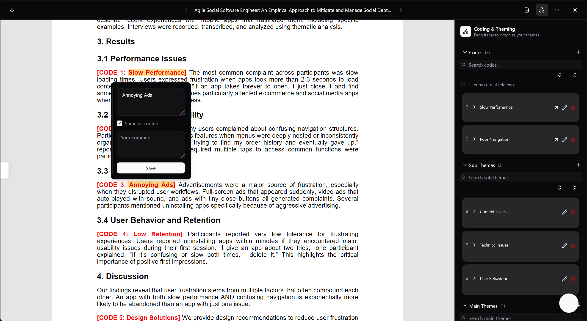

Click **View** in the PDF column of any row that has an attached PDF. The in-browser
PDF viewer opens in full-screen mode with the **Data Extraction** form sidebar on the
right. You can read the paper and fill in extraction answers simultaneously without
leaving the page. The sidebar lists every section and question; answers typed here are
saved to the same cells in the main table.

Click **Mark as Completed** at the bottom of the sidebar to mark the reference as done
without returning to the table. The **+** button in the bottom-right of the viewer opens
a quick-add panel to create a new code if you want to annotate a passage at the same
time (see [Coding & Theming](/docs/user-guide/coding-theming)).

---

## Managing Questions

### Adding a question

Click the **+** button at the far right of the table header row to open the **Add
Question** popover. Fill in:

- **Section**: choose an existing section or type a new name to create one.
- **Question**: the full question text shown to reviewers.
- **Type**: Free Text, Number, Date, Boolean, Single Select, or Multi Select.
- **Column Title**: the short label displayed as the column header.
- **Required Question**: toggle on to prevent a reference being marked complete without an answer.

Click **Add** to save. The new column appears immediately in the table.

> Only **Owners** and **Collaborators** can add, edit, or delete questions and sections.

### Editing or deleting a question

Hover over a column header and click the edit (✏️) or delete (🗑) icon that appears.
Deleting a question permanently removes all answers associated with it. This cannot be
undone.

---

## Toolbar

| Button           | Action                                                             |
| ---------------- | ------------------------------------------------------------------ |
| **Add articles** | Manually promote additional references into extraction             |
| **Export**       | Download the extraction table as a CSV spreadsheet                 |
| **Extract data** | (AI-assisted extraction, extracts answers from PDFs automatically) |
| **Title ↑**      | Sort toggle                                                        |
| **Filters**      | Show or hide the right-hand filter sidebar                         |

---

## Bulk Actions

Select one or more rows using the checkboxes, then use the action bar at the bottom:

- **Mark as Completed / Mark as Incomplete**: update the done status for all selected rows.
- **Label**: apply a label to all selected references.
- **PDF**: open the PDF management dialog for the selected references.

# Coding & Theming

The Coding & Theming page supports qualitative synthesis by letting you highlight
passages in PDFs and organise them into a thematic hierarchy. The three-level structure,
**Codes**, **Sub Themes**, and **Main Themes**, lets you move from raw observations
up to high-level conceptual groupings by dragging and dropping cards between columns.

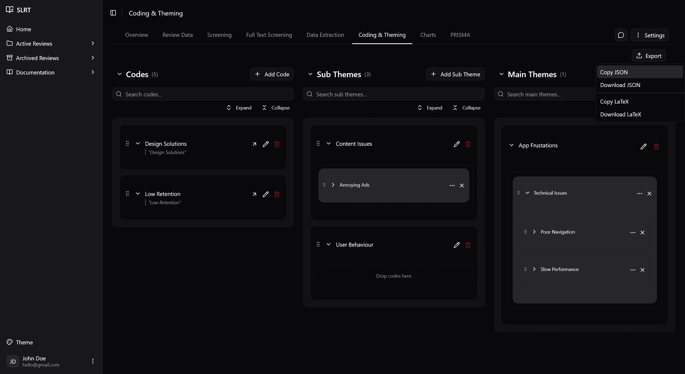

---

## The Three-Column Layout

The page presents three columns side by side.

**Codes**: individual annotations created by highlighting a passage in a PDF or by
adding a free-text observation. Each code card shows the code name, an optional comment,
and the title of the paper it came from. A jump-to-source arrow (↗) opens the PDF
viewer directly at the highlighted passage.

**Sub Themes**: named groupings that collect related codes. A sub theme card can
display the codes assigned to it as nested items when expanded. Sub themes can
optionally be unassigned, a code can exist without belonging to a sub theme.

**Main Themes**: top-level conceptual groupings that collect related sub themes. Sub
theme cards appear nested inside main theme cards when expanded.

Unassigned items (codes without a sub theme, or sub themes without a main theme) float
at the top of their respective column.

---

## Creating Items

- **+ Add Code**: opens a dialog to create a new standalone code with a name and optional comment.
- **+ Add Sub Theme**: opens a dialog to create a new sub theme with a name and description.
- Edit or delete items using the **✏️** and **🗑** icons that appear on hover.

You can also create codes directly from the PDF viewer by selecting text, see
[Creating a Code from a PDF](#creating-a-code-from-a-pdf) below.

---

## Organising with Drag and Drop

Drag a **Code** card from the Codes column and drop it onto a **Sub Theme** card to
assign it. A ghost overlay follows the cursor while dragging to give visual feedback.
Drop a code back onto an empty area of the Codes column to remove its sub theme
assignment.

Drag a **Sub Theme** card and drop it onto a **Main Theme** card to assign it. A "Drop
codes here" placeholder appears on sub theme cards while a code is being dragged.

This interaction lets you build a complete thematic map iteratively without needing to
use dialogs for every re-organisation step.

---

## Searching and Collapsing

Each column has an independent **search** field at the top that filters cards in that
column by name. The **Expand** and **Collapse** buttons toggle all cards in the column
open or closed at once, useful when a column has many items.

---

## Creating a Code from a PDF

Open the PDF viewer from any reference that has an attached PDF (click the Jump button
, or from Data Extraction). Select a passage of text or
draw a region on a page. A small popover appears:

- **Name**: the code label (auto-filled with the selected text when in text highlight mode).
- **Comment**: an optional annotation note.
- **Same as content** checkbox: when checked, the comment is pre-filled to match the selected text.

Click **Save** to create the code. It immediately appears in the Codes column.

The **coding sidebar** on the right of the PDF viewer lists all existing codes and sub
themes for the review. Use the **Filter by current reference** toggle to narrow the
list to codes created from the currently open paper. Clicking a code in the sidebar
scrolls the PDF to the corresponding highlight automatically.

---

## Highlight Types

Codes can be created from several types of annotation:

| Type          | Description                                                                |
| ------------- | -------------------------------------------------------------------------- |
| **Text**      | A selected run of text; stored with the text content and page bounding box |
| **Area**      | A drawn rectangle over any region (image, table, diagram)                  |
| **Free text** | A typed note not associated with a specific page location                  |

Text and area highlights appear as coloured overlays on the rendered PDF pages in
subsequent viewing sessions.

---

## Jump to Source

Every code card in the Codes column has a **↗** icon. Clicking it opens the PDF viewer
for the reference the code came from and scrolls to the exact page and position of the
highlight. This links every coded observation back to its source in the primary
literature without manually navigating to the right page.

---

## Exporting the Coding Structure

Click **Export** in the toolbar (top-right) to download the full coding structure,
all codes, sub themes, main themes, and their relationships, in one of four formats:

| Option             | Output                                              |
| ------------------ | --------------------------------------------------- |
| **Copy JSON**      | Copies the JSON structure to the clipboard          |
| **Download JSON**  | Saves a `.json` file                                |
| **Copy LaTeX**     | Copies a LaTeX-formatted structure to the clipboard |
| **Download LaTeX** | Saves a `.tex` file                                 |

# Charts

The Charts page visualises the structured answers collected during Data Extraction across
all included references. It provides four chart types in a tabbed dashboard, each with
its own axis or question configuration controls. All charts are rendered as SVG and scale
cleanly to different screen sizes.

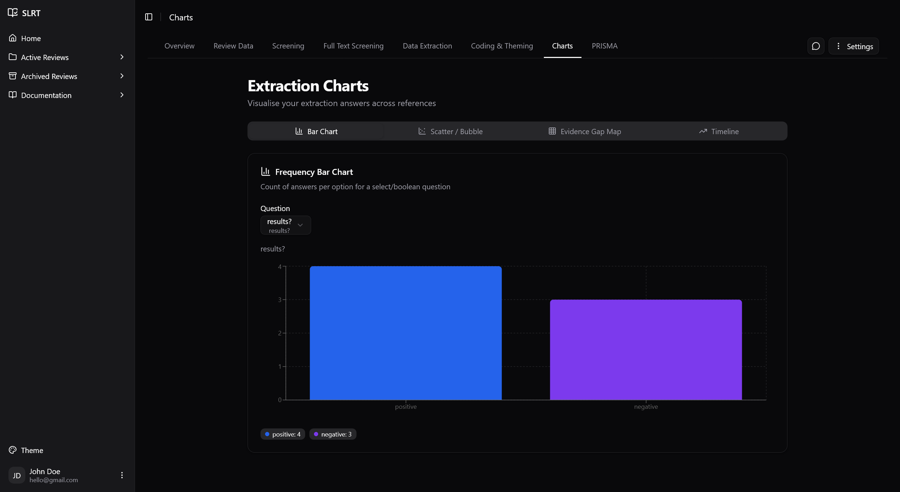

---

## Bar Chart

The **Frequency Bar Chart** counts how many references gave each answer to a selected
**Single Select**, **Multi Select**, or **Boolean** extraction question and plots them as
vertical bars.

**How to use:**

1. Open the **Bar Chart** tab.
2. Select a question from the **Question** dropdown. Only select/boolean questions are
   listed since free-text and numeric answers cannot be meaningfully grouped into bars.
3. The chart updates immediately showing each answer option as a separate bar with its
   count.

Use this chart to understand the distribution of a categorical extraction field across
your included literature, for example, the breakdown of study designs or geographic
regions.

---

## Scatter / Bubble

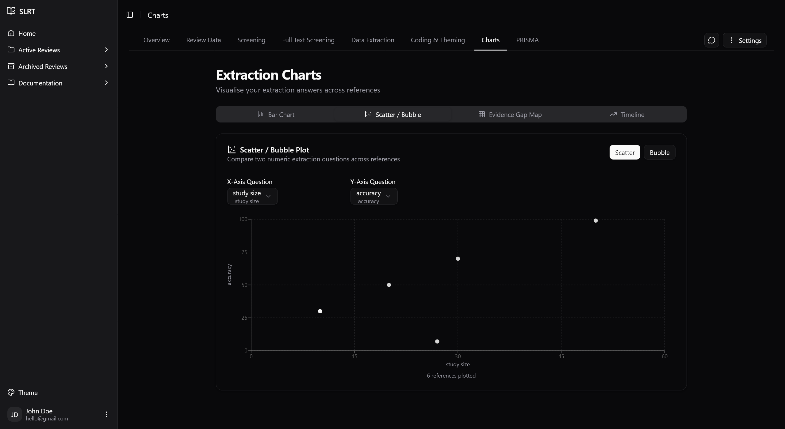

The **Scatter / Bubble Plot** maps two **Number** extraction questions onto X and Y axes,
placing one dot per reference.

**How to use:**

1. Open the **Scatter / Bubble** tab.
2. Choose an **X-Axis Question** and a **Y-Axis Question** from the dropdowns. Only
   numeric questions are listed.
3. Switch between **Scatter** (equal-sized dots) and **Bubble** (dot size proportional
   to the number of references matching the coordinate) using the toggle in the top-right corner of the chart
   panel.

The chart shows the count of plotted references at the bottom. References without a
value for either axis question are excluded from the plot.

---

## Evidence Gap Map

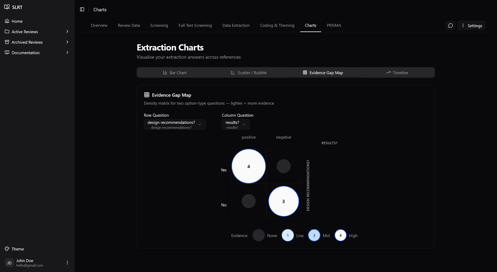

The **Evidence Gap Map** renders a bubble grid (density matrix) where:

- The **rows** represent the answer options of one categorical extraction question.
- The **columns** represent the answer options of another categorical extraction question.
- Each cell contains a bubble whose **size and shade** indicate how many references fall
  into that combination.

**How to use:**

1. Open the **Evidence Gap Map** tab.
2. Select a **Row Question** and a **Column Question** from the dropdowns. Only
   Single Select or Multi Select questions appear.
3. The map updates to show the density of evidence for every combination of answers.

Cells with no references appear as small dark circles; cells with many references appear
as large bright circles. A legend at the bottom shows the mapping from circle size to
count (None, Low, Mid, High). This chart is useful for identifying under-researched
combinations of study characteristics, the "gaps" in the evidence base.

---

## Timeline

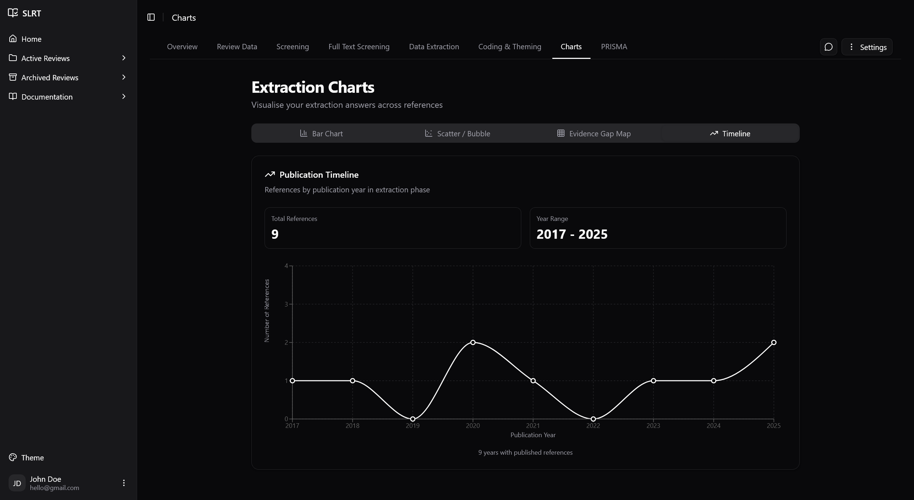

The **Timeline** chart plots the publication years of all included references as a line
chart, showing the temporal distribution of the literature.

**How to use:**

1. Open the **Timeline** tab.
2. The chart is generated automatically from the publication dates stored on each
   reference. No configuration is needed.

Each point on the line represents the count of references published in that year. Use
this chart to see whether the literature is recent or historically distributed, and to
identify years with particularly high research activity.

---

> Charts on this page reflect the answers entered in the **Data Extraction** table. If
> no answers have been recorded yet, or if no references have been marked as included,
> the charts will be empty. Complete at least a portion of data extraction before
> visiting this page.

# PRISMA Diagram

The PRISMA page automatically generates a **PRISMA 2020** flow diagram populated with
counts derived from your review's data. You do not need to enter any numbers manually:
every count is computed from the references, opinions, and duplicate resolution records
already in the database.

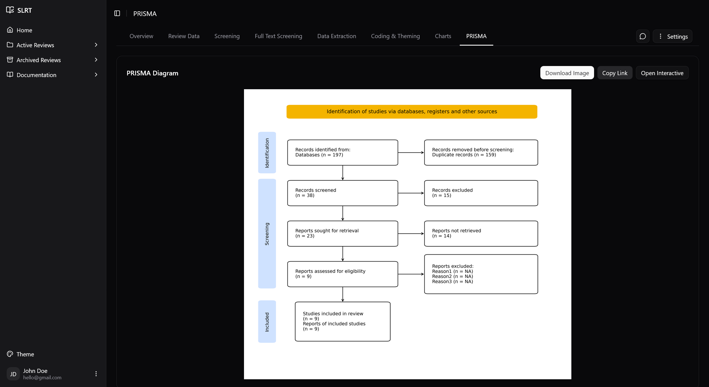

---

## Reading the Diagram

The diagram follows the four-phase PRISMA 2020 structure:

| Phase              | What it shows                                                                                                                                                                                                   |
| ------------------ | --------------------------------------------------------------------------------------------------------------------------------------------------------------------------------------------------------------- |
| **Identification** | Total records identified from databases; records removed before screening (duplicates deleted during duplicate detection)                                                                                       |
| **Screening**      | Records screened (non-deleted references); records excluded (references given an Excluded opinion during title/abstract screening)                                                                              |
| **Eligibility**    | Reports sought for retrieval (references promoted to full-text screening); reports not retrieved (full-text references without a PDF attached); reports assessed for eligibility; reports excluded with reasons |
| **Included**       | Studies included in the review; reports of included studies                                                                                                                                                     |

The exclusion reasons in the Eligibility phase are drawn from the **Reason** records
attached to excluded opinions during full-text screening. Each named reason appears as a
separate line with its count.

---

## Downloading and Sharing

Three buttons appear in the top-right corner of the page:

| Button               | Action                                                                                   |
| -------------------- | ---------------------------------------------------------------------------------------- |
| **Download Image**   | Saves the diagram as a PNG file suitable for inclusion in a manuscript                   |
| **Copy Link**        | Copies a shareable URL to the clipboard that opens an interactive version of the diagram |
| **Open Interactive** | Opens the interactive diagram in a new browser tab                                       |

The interactive version is hosted externally and allows panning and zooming. It is
generated from the same data as the static image.

---

## Keeping the Diagram Up to Date

The diagram is generated fresh each time you visit the PRISMA page, so it always
reflects the current state of your review. There is no need to refresh or regenerate
it manually. As you include or exclude more references, attach PDFs, or run duplicate
detection, the counts update automatically on the next visit.

---

> If the diagram shows unexpected counts, check the following:
>
> - Duplicate detection has been run and resolved (deleted duplicates reduce the Identification count).
> - Exclusion reasons have been attached to excluded references in the Full Text Screening stage (reasons appear in the Eligibility exclusions breakdown).
> - References have been explicitly marked as Included or Excluded rather than left as Undecided.

